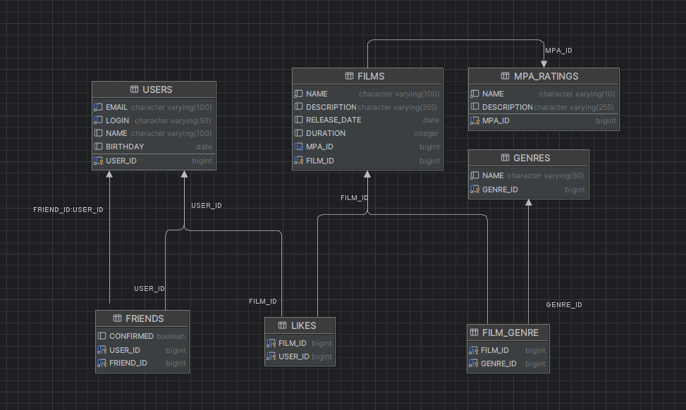

# java-filmorate
Проект социальной сети для оценки фильмов

## Схема базы данных

### Описание таблиц:
1. **USERS** - хранит данные пользователей:
    - `USER_ID` - уникальный идентификатор
    - `EMAIL`, `LOGIN`, `NAME` - персональные данные
    - `BIRTHDAY` - дата рождения

2. **FILMS** - содержит информацию о фильмах:
    - `FILM_ID` - уникальный идентификатор
    - `NAME`, `DESCRIPTION` - название и описание
    - `RELEASE_DATE`, `DURATION` - дата выхода и продолжительность
    - `MPA_ID` - рейтинг MPA (ссылка на MPA_RATINGS)

3. **MPA_RATINGS** - справочник рейтингов MPA
4. **GENRES** - справочник жанров фильмов
5. **FRIENDS** - связи дружбы между пользователями
6. **LIKES** - лайки фильмов от пользователей
7. **FILM_GENRE** - связи фильмов с жанрами
